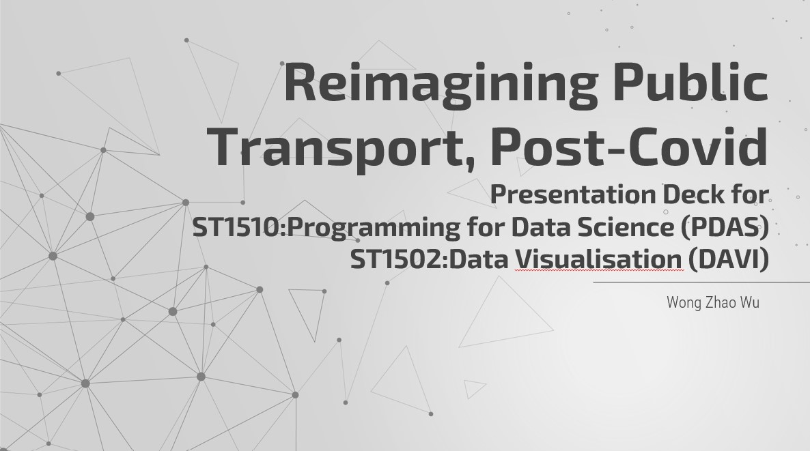

# Reimagining Public Transport, Post-Covid
Assignment of ***ST1510:Programming for Data Science*** & ***ST1502:Data Visualisation***

Author : Wong Zhao Wu

## Background Context:

The COVID-19 pandemic in Singapore is caused by severe acute respiratory syndrome coronavirus 2 (SARS-CoV-2), which spreads primarily through droplets generated when an infected person coughs, sneezes or speaks. In response to the growing number of new community cases, Singapore enacted the COVID-19 Control Order, "circuit breaker", which caused a huge impact towards current public transport system and sparks the discussion over the reimagination for the public transport model to cater the change in commute pattern and in preparation for future epidemic spread by airborne transmission.

## Objectives of Study:
1. Visualise Impacts of COVID-19 toward Singapore Public Transport System (Train & LRT, Taxi and Flight).
2. Investigate Solutions to Reimagine Singapore Public Transport System.

## Conclusion
The **short term heavy impact** towards public transport system clearly indicates its flaw towards epidemic caused by airborne transmission.

Even if COVID-19 is stabalised by current vaccination program in Singapore, [article](https://www.straitstimes.com/world/when-will-life-return-to-normal-in-7-years-at-current-covid-19-vaccination-rates) have shown that it will take at least 7 years before life can turn back to pre-Covid norm on a global scale and the risk of another highly infectious epidemic caused by airborne transmission cannot be neglected.

We should learn from this experience and reimagining current public transport system by -***promoting micromobility*** and ***staggering work hours***- such that impact towards public transport model can be mitigated.

# Credits
##### 1.1 Train and LRT
- [https://www.sbstransit.com.sg/ridership](https://www.sbstransit.com.sg/ridership)
##### 1.2 Taxi
- [https://www.lta.gov.sg/content/ltagov/en/who_we_are/statistics_and_publications/statistics.html](https://www.lta.gov.sg/content/ltagov/en/who_we_are/statistics_and_publications/statistics.html)
- [https://data.gov.sg/dataset/civil-aircraft-arrivals-departures-passengers-and-mail-changi-airport-monthly](https://data.gov.sg/dataset/civil-aircraft-arrivals-departures-passengers-and-mail-changi-airport-monthly)
##### 1.3 Flight
- [https://www.changiairport.com/corporate/our-expertise/air-hub/traffic-statistics.html](https://www.changiairport.com/corporate/our-expertise/air-hub/traffic-statistics.html)
##### 2.1 Rethinking Micromobility:Promote Use of Micromobility Devices
- [https://data.gov.sg/dataset/cycling-path-network](https://data.gov.sg/dataset/cycling-path-network)
- [https://data.gov.sg/dataset/hdb-cycling-paths-under-construction](https://data.gov.sg/dataset/hdb-cycling-paths-under-construction)
##### 2.2 Change Commuter Patterns: Stagger Work Hour
- [https://datamall.lta.gov.sg/content/datamall/en/dynamic-data.html](https://datamall.lta.gov.sg/content/datamall/en/dynamic-data.html)
- [https://developers.onemap.sg/commonapi/search](https://developers.onemap.sg/commonapi/search)
